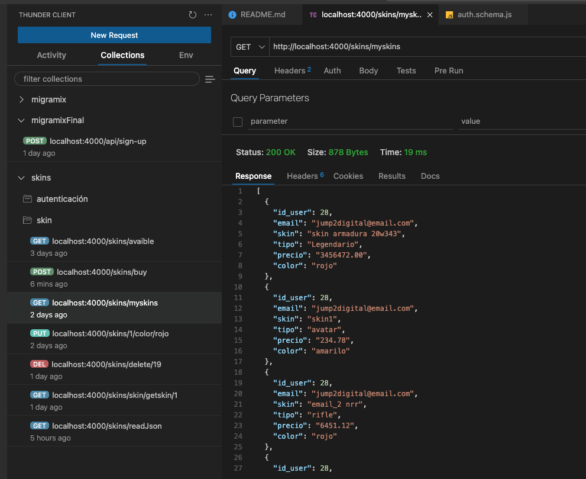

# JUMP<span style="color:red">2</span>DIGITAL: BACKEND SKINS

Este proyecto realiza un CRUD sobre una entidad llamada skin, se consume a traves de una API la cual tiene mecanismos de autenticación y autorización a recursos; está implementado sobre el framework express con una conexión a base de datos postgresql.

Dante Espinoza dent007@gmail.com

# Estructura de directorios:

- 

- El proyecto de modularizó en sub-capas a fin de que en cada capa se resuelva una funcionalidad de todo el sistema y que las responsabilidades sean independientes pero puedan dar servicios a las otras sub-capas adyacentes:

- Modulo server.js: Incia el enrutamiento de las peticiones http entrantes que se atienden en el puerto 4000 según requieran o no autorización o autenticación, para ello ejecuta un middleware que resuelve una determinada funcionalidad antes de acceder y retornar el recurso, en este:


- <u>La ruta "/auth"</u> Contiene una funcnalidad que resuelve las rutas públicas que inicilizan la autentivación y autorización.
- <u>La ruta "/skins"</u> Contiene una funcnalidad que resuelve las rutas privadas a travez de las cuales se consume la API de skins

- Modulo /routes: Ofrede servicios a la capa server validando la estructura de los campos del formulario incluidos como contenido en el cuerpo o body de request.

- <u>auth.routes</u> Contiene la funcionalidad que resuelve las rutas públicas que inicilizan la autentivación y autorización.


- <u>skin.routes</u> Contiene una funcnalidad que resuelve las rutas privadas a travez de las cuales se consume la API de skins


\*\* Funcion validateSchema(schema) recibe un esquema que establece restricciones que deben cumplir los campos en el formulario recibido como son el tipo de dato, cantidad de caracteres, formato de email. etc. Con este esquema recibido valida el contenido del formulario.


\*\* Funcion authentication usada en los endpoints que necesitan autenticación, verifica las firmas al comparar la firma dentro del token recibido con la firma que se persiste en el servidor dentro de una variable de entorno TOKEN_SECRET. Si coinciden se ejecuta la funcion next() la cual sigue el flujo de ejecucuón del endpoit de la API.


- Modulo /controllers: Este modulo contiene las funcionalidades para acceder a la base de datos y obtener el recurso solicitado desde el servidor haciendo uso de consultas SQL que se serán envevidas en las funcionalidades del controlador pg

endpoin /register ,registro de usuario


endpoin /login ,inicio de sesión de usuario


endpoin /logout ,cerrar sesion de usuario


endpoin /createSkins , permite adquirir un skin, (Losiento por el nombre que no corresponde, tendría que haberse llamado adquirirSquin)


endpoin /getskins , permite listar todas las skins


endpoin /getMyskins , permite listar solo las skins del usuario que está autenticado actualmente en el sistema


endpoin /updateMySkins , permite actualizar solo las skins del usuario que está autenticado actualmente en el sistema


endpoin /deleteMySkins , permite eliminar solo las skins del usuario que está autenticado actualmente en el sistema


endpoin /getSkinById , permite buscar y listar contenido de una skin según el id que le pasemos como parámetro.


endpoin /readJson , permite leer un fichero json el cual contiene un arreglo de objetos tipo skin, de este, el usuario podrá adquirir una skin


# Consumiendo el servicio:

- Para consumir los end point de la API, usamos cliente Thunder que mediante el protocolo http y tcp/ip resuelve la comuicación cliente servidor

- Levantar el servidor para que resuelva las peticiones del cliente, para lo cual se necesita abrir una instancia de terminal en el ide, para ese ejemplo uso visual studio code.

  ```js
  npm run dev
  ```


- Creación de nuevo usuario. Para que un usuario pueda usar el sistema, primero debe registrarse usando credeciales como son email y password. Por simplicidad se usó solo estos dos campos, pero deberían ser los necesarios según el requerimiento o caso se uso. Este proceso va acompañado de un hasheo de password


\*\* El sistema permite validar los emails repetidos, cuando se pretende reusar un email ya existente para crear nueva cuenta, retorna un mensaje de error.


- Login o Acceso al sistema. El usuario tendrá que hacer uso de sus credenciales para acceder al sistem y usar su funcionalidade. Luego que el sistema vertifica sus credenciales, este le retorna un token jwt el cual contiene información para autorizarle el uso de recursos como hacer uso de los endpoints del skiin


- Listar un fichero JSON con la lista de los skins disponibles para que el usuario pueda elejir un skin


- Seleccionar un skin para agregar a lista personal de usuario autenticado y autorizado actualmente en el sistema.


- listar todos los skins.


- listar solo los skins del usuario logeado .



- Cambiar el contenido del atributo color a verde. El id sel skin se pasa como parámetro en la url


- Buscar y listar un skin según un id pasado como parámetro en la url.


